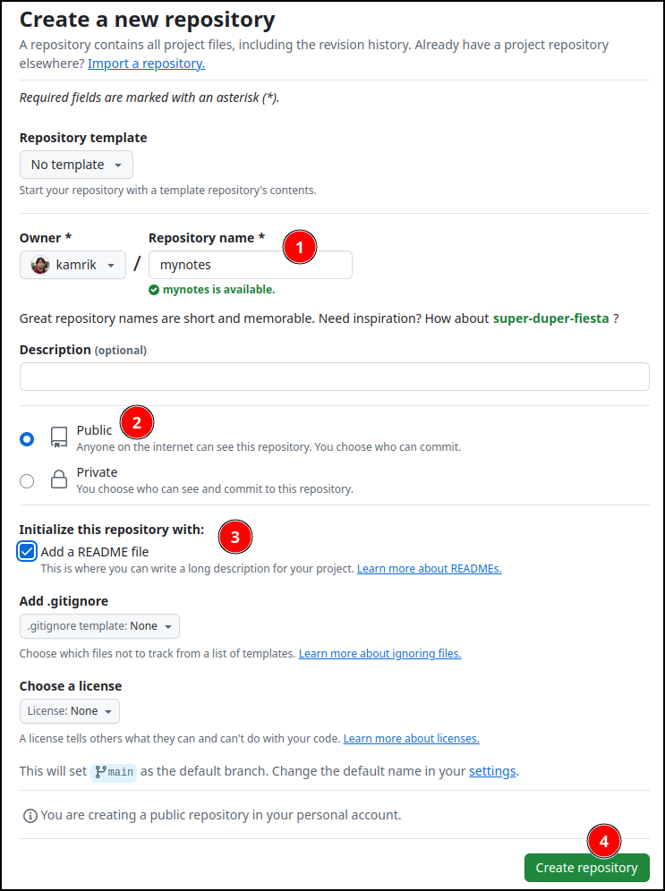
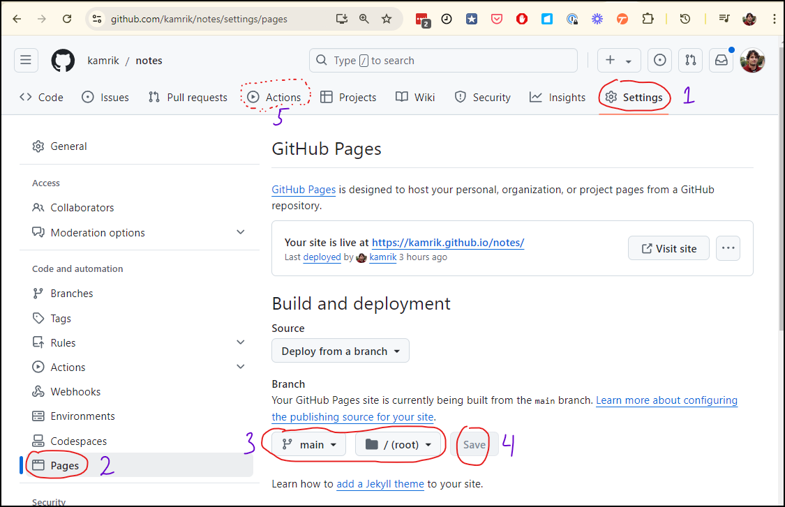
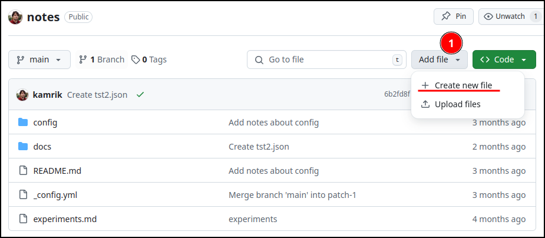
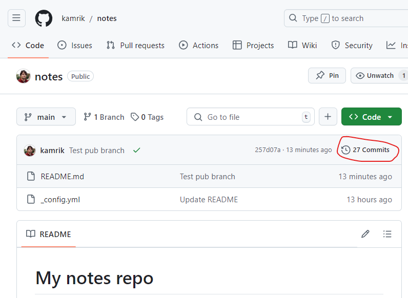

# Home Assignment 1 - GitHub Pages


## Step 1 - Create your own public repo
In the labs so far we edited files in a repository created by GitHub Classroom. In this assignment you will need to work with two repositories:

1. Your own repository, where most of the editing will happen
1. The usual GitHub Classroom repo like in the labs, with an address like this: `github.com/comp1238w25/asgn1-username`. It will be used to tell the autograder where to look for the first repo.


To create your own repository, go to [github.com](https://github.com) and click the green `New` button. Alternatively you can go directly to [github.com/new](https://github.com/new). Then follow the steps below. Numbers refer to the red circles on the screenshot.

1. Select a name for your repo. Something simple like "notes" or "links" or "gbc" is best. The idea is to make this repo useful beyond this lab.

1. Select the "Public" option. This is important because the GitHub Pages feature is not available for private repos, unless you are using a paid account.

1. Check the "Add README" checkbox

1. Click the big green button "Create repository" at the bottom.




## Step 2 - Enable "GitHub Pages" on your repo
`GitHub Pages` creates a website from the MarkDown files in your repository. Enable GitHub Pages using the screenshot below (follow the number order).

(1) `Settings` → (2) `Pages` → (3) Branch: `main`, folder `(root)` → (4) click **`Save`**




It takes about 40 seconds for the change to take effect. You can see the progress under “Actions”. GitHub uses a process similar to the autograder to convert your MarkDown files into a website. The website will be rebuilt each time you change anything in the repo.

You can see your new page at  
`https://your_username.github.io/repo_name`  
Note the `.io` instead of `.com` in `github.io`  
For example Mark’s page is at   
https://kamrik.github.io/notes/  
because the repo is called `notes` and the username is `kamrik`

Congratulations, you have your own website! Let's add some content.


## Step 3 - Add a `## Links` section in README.md

Edit the files using whichever tool your prefer - GitHub web UI we used for labs 2 & 3 is also ok.

Copy the markdown below into this section. Feel free to modify it later, but for now we need some filler text to work with.

```markdown
## Links
- [D2L](https://learn.georgebrown.ca)
- [AtKlass](https://app.atklass.com)
- [Important Dates](https://www.georgebrown.ca/current-students/important-dates?term=27246&category=131)
```


## Step 4 - change your website's visual theme
- Create a new file called  `_config.yml` (this exact name)
- Copy the following 2 lines into it

```
title: Demo notes repo
theme: jekyll-theme-architect
```

After you commit (save) this file, GitHub will rebuild the website. It takes some time, 20-40 seconds, you can see the progress under `Actions`. Check how your website looks like with the new theme.


Experiment with applying any of the following themes. You can remove the `theme` line from _config.yml to go back to the default theme.

- [jekyll-theme-architect](https://pages-themes.github.io/architect/)
- [jekyll-theme-cayman](https://pages-themes.github.io/cayman/)
- [jekyll-theme-dinky](https://pages-themes.github.io/dinky/)
- [jekyll-theme-hacker](https://pages-themes.github.io/hacker/)
- [jekyll-theme-leap-day](https://pages-themes.github.io/leap-day/)
- [jekyll-theme-merlot](https://pages-themes.github.io/merlot/)
- [jekyll-theme-midnight](https://pages-themes.github.io/midnight/)
- [jekyll-theme-minimal](https://pages-themes.github.io/minimal/)
- [jekyll-theme-modernist](https://pages-themes.github.io/modernist/)
- [jekyll-theme-slate](https://pages-themes.github.io/slate/)
- [jekyll-theme-tactile](https://pages-themes.github.io/tactile/)
- [jekyll-theme-time-machine](https://pages-themes.github.io/time-machine/)

How to add a new file using GitHub web UI:



## Step 5 - Create another file named `comp1238.md`

Each MarkDown (.md) file will become a page of your website. README.md you edited in the previous steps becomes the main page, but for a real "website experience" we need at least one other page.

### Step 5.1
Create a file named `comp1238.md`. Refer to the screenshot above or instructions from lab4 on how to add a new file.


### Step 5.2
In the new file add a headings for each of the first 5 weeks and in each section create a bullet list with at least 2 items you think might be worth remembering for the midterm.

For example:
```markdown
## Week 1 - History
- One writing system can be used by many languages
- Cuneiform looks weird
- The Epic of Gilgamesh was epic
## Week 2 - Bits and Bytes
...

```

You may want to use the [lecture summaries](../summaries/) for this.
Feel free to add any text and links on top of the required 2 bullet items.


### Step 5.3
Edit the README file to add a link from there to the new comp1238.md file. Otherwise you won't be able to access the page corresponding to this new file on your website. A link to a file located in the same repo looks like this:  
`[link text](comp1238.md)`  
For example, a link to the autograder instructions looks like  
`[about autograder](autograder_instructions.md)`  
and renders as
[about autograder](autograder_instructions.md)


## Step 6 - Explore repository history
Go to the root of your repo and click the clock icon under the green "Code" button (see screenshot). This will show the history of all commits you made. Click on some of the commits to see how they look like. Spend some time exploring the history UI.



## Step 7 - OPTIONAL - create a schedule with D2L links

In the README file add your schedule as a nested bullet list, where each course name is a link to the course D2L page. Like this:

- **Monday**
  - 13:00 - [COMP1238 - Data Mgmnt](https://learn.georgebrown.ca/d2l/home/334969)
  - 16:00 - COMP0000 - Not a real course
- **Tuesday**
  - etc


## Step 8 - Submit your work
- Follow the assignment invitation link:  
  https://classroom.github.com/a/3ltiIQBl
  
- In the new Classroom repo edit the README file and append a link to your repo with the site at the bottom. The link should look like this:  
`https://github.com/username/repo_name`  

- Commit - this will trigger the autograder. Check for output under "Actions". Make sure to read the output in the black section.

- To submit again, make any change in the README, for example


```
...
attempt number 42
https://github.com/username/repo_name
```

> - Changes to the GitHub Classroom repo at `github.com/comp1238w25/asgn1-username` will trigger the autograder  
> - Changes to your website repo at `github.com/username/repo_name` trigger a rebuild of the website, but NOT the autograder.


### The autograder will be looking for the following points

1. A link to your GitHub repo is provided and looks like this  
  `https://github.com/username/repo_name`  
   - With or without the https:// part is ok  
   - Make sure the user and repo names are yours
1. Repo pointed to by that link exists

1. The README.md file in that repo contains a link to comp1238.md

1. `comp1238.md` file exists and contains titles `## Week 1` ... `## Week 5` with at least 2 lines of text under each title
    
1. The website `username.github.io/repo_name` is active 


