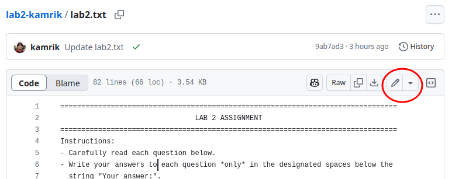
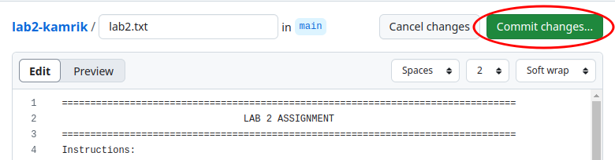
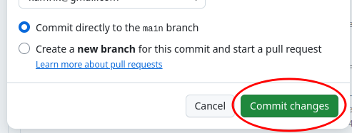
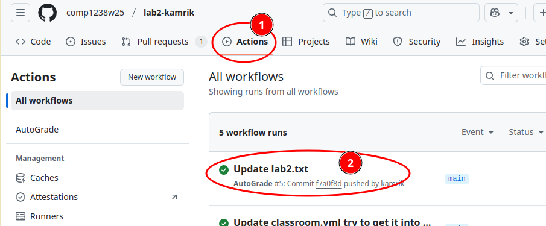
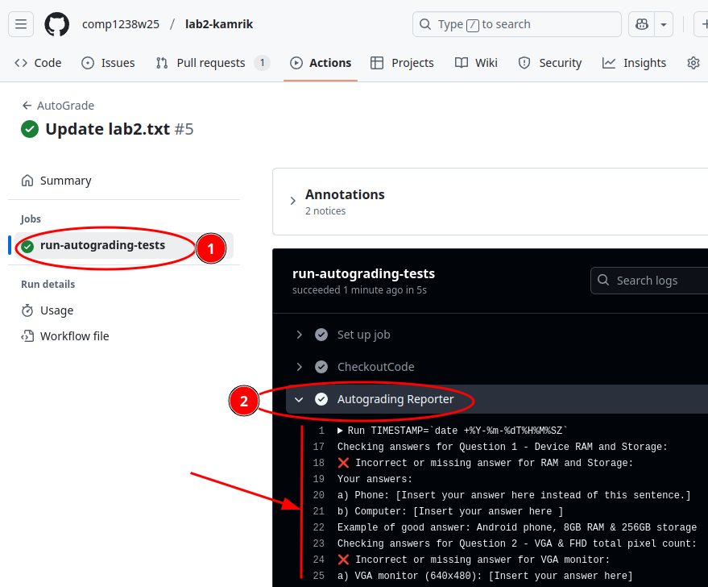

## Instructions for Auto-Graded Assignments

1. **Saving a File to Trigger Auto-Grading**  
   - Whenever you save (commit) a file in an auto-graded assignment, a script will run to evaluate your work.  
   - The script’s output can be viewed in the `Autograding Reporter` section, located under the `Actions` tab.  
   - Refer to the screenshots below for guidance.  

   ⚠️ *Note: The auto-grading process takes approximately 30 seconds. Please allow some time for it to complete.*

2. **How to Edit and Save Files**  
   
   - **Step 1: Edit the File**  
       
   
   - **Step 2: Save Your Changes**  
     Once you’ve made your edits, click the **Commit changes** button.  
       
   
   - **Step 3: Confirm Save (Commit Changes)**  
     In the pop-up dialog, click the **Commit changes** button again to finalize your save.  
     

3. **Viewing Auto-Grading Results**  

   - To check the results of the auto-grading process, follow these steps:  
     
     1. Navigate to the `Actions` tab.  
     2. Look for the most recent workflow run listed at the top under **All Workflows** and click it.  
     3. Then click on **run-autograding-tests**.  
     4. In the workflow details (a black area), locate the `Autograding Reporter` step.  
     5. Review the results displayed in the black area for:  
        - Your final grade.  
        - Any hints or feedback on potential issues.  

       

     
