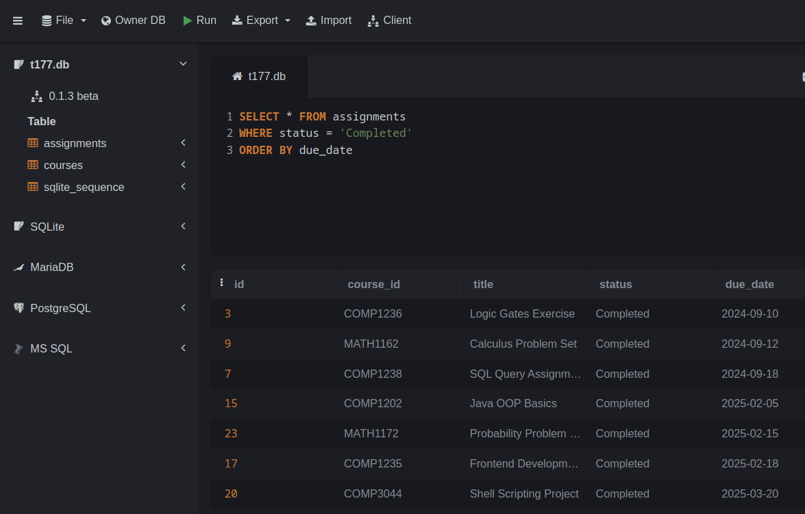

# Lab 11 - SQL


## Material covered during the lecture:
- Relational databases and SQL

## The goal for today
Gain experience running simple SQL SELECT queries


## Step 1 - open the database in sqliteonline.com
Open the practice SQLite database using the link below.
You should see the Courses and Assignments tables in the left panel.

https://sqliteonline.com/#urldb=https://raw.githubusercontent.com/kamrik/IntroText/refs/heads/main/examples/sql/t177.db

If you are curious, this DB was initialized using this file - [t177.sql](../examples/sql/t177.sql)

## Step 2 - create an empty file for your queries
Copy and paste all the queries your run successfully into a file. 
The file name should end with `.sql`, for example
`lab11.sql`. 
Either create it directly in you repo on github.com or place it in the repo when done.

Submit a link to this file on D2L when done with this lab.

Use double dash to add any comments in the file, like this:

```sql
-- Some comment that is ignored by the DB
SELECT * 
FROM courses
``` 

## Step 3 - run some queries to get started
Run each of the following SELECT queries.
To execute the query on sqliteonline.com you can either press `Shift-Enter` on the keyboard or the green triangle play button at the top of the page.

Observe the results for each query and try to understand it.

```sql
SELECT * FROM courses;

SELECT * FROM assignments
LIMIT 10; 

SELECT count(*) FROM courses;

SELECT min(due_date) FROM assignments;

SELECT *
FROM  courses
WHERE course_name LIKE 'Intro%';

SELECT *
FROM  assignments
WHERE status != 'Completed'
ORDER BY due_date;

-- Use this query as a reference for the next step
SELECT course_id, title, status, due_date
FROM assignments
WHERE status != 'Completed'	
  AND course_id LIKE 'COMM%'
  AND due_date < '2024-12-31'
ORDER BY due_date;
```

## Step 4 - write queries for the following tasks
Here are some exercises that help students practice simple `SELECT` statements and basic aggregation functions on this database without using `JOIN` operations. 

### Exercise Questions


1. **Assignments for a Specific Course**  
   Write a query to display the `title` and `due_date` of assignments for the course `COMP1234`.


2. **Earliest Assignment Due Date**  
   Write a query to find the earliest assignment due date in the `assignments` table. Hint: use `SELECT min()`

   
3. **Latest Assignment Due Date**  
   Write a query to find the latest assignment due date in the `assignments` table.

  
4. **Find All Assignments Due in October**  
   Write a query to display the `title` and `due_date` of assignments due in October 2024. Hint: use `LIKE '2024-10%'`

5. **Assignments Due on a Specific Date**  
    Write a query to find the `title` and `course_id` of assignments due on `2024-10-08`.

6. **Find the Most Recent Completed Assignment**  
    Write a query to find the most recent `due_date` of assignments with a status of "Completed".


## Optional tasks

1. **Count of "Not Started" Assignments**  
   Write a query to find the total number of assignments with a status of "Not Started". Remember to use single quotes for strings in SQL.

1. **Find Courses with Labs on Tuesday**  
   Write a query to find the `course_id` and `course_name` of courses that have lab sessions on Tuesday. Hint: use `LIKE 'Tue%`
   
1. **Write a query that joins the two tables**  
    Hint:
    ```sql
    ...
    JOIN the_other_table 
      ON courses.course_id = assignments.course_id
    ...
    ```


## Examples screenshot




## Submission instructions
Submit:
 - Link to the .sql file in you GitHub repo
 - One screenshot with a query you liked the most, or found the most challenging
