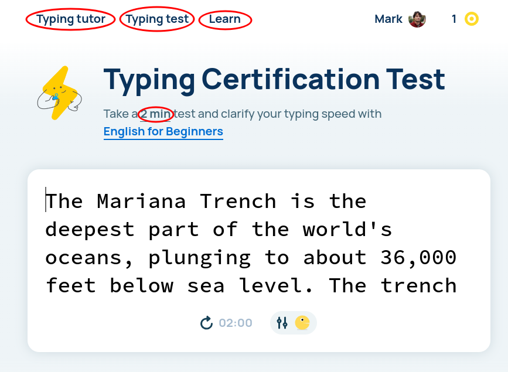

# COMP1238 - Week 1 - Typing Practice Lab

Welcome to the Typing Practice Lab! Follow the instructions below to improve your typing skills. Ratatype and Keybr are slightly different in ther approach, it's best to try both and stick with the one you like better.

## Instructions

1. **Sign Up for Ratatype and Keybr**
    - [keybr.com](https://www.keybr.com/) - Read the onboarding slides and click `Sign-in` in the upper right corner.
    - [ratatype.com](https://www.ratatype.com/) - Click `Hey! Login` in the upper right corner.
    - You can use any email or identity account, it doesn't have to be your GBC account.

1. **Practice Tests**
    - After logging in, navigate to the testing section
        - Keybr - [keybr.com/typing-test](https://www.keybr.com/typing-test)
        - Ratatype - [ratatype.com/typing-test](https://www.ratatype.com/typing-test)
    - Take several practice tests to get comfortable with the interface.

1. **Take a 1-Minute Test and submit a screenshot on D2L**
    - Once you've completed your practice tests, take a 1-minute typing test.
    - After completing the test, take a screenshot of your results.
    - Submit the screenshot on D2L under the "Lab 1 assignment".
    - Your speed doesn't matter at this point, we only want to make sure you sign up and try out the platform.

1. **Typing Lessons**
    - Head over to the practice section
        -  [Keybr Practice](https://www.keybr.com/)
        -  [Ratatype Typing Tutor](https://www.ratatype.com/typing-tutor/)
    - Complete several lessons to work on improving your typing skills.
    - Take a look at the Learn / Help sections
        - [Ratatype Learn](https://www.ratatype.com/learn/)
        - [Keybr Help](https://www.keybr.com/help)

1.  **Daily Typing Practice**
    - Practice daily for 10-15 minutes to steadily increase proficiency and typing speed. Frequent short practice sessions work much better than infrequent long ones.
    - Subscribe to the [r/Typing](https://reddit.com/r/typing) subreddit - it's great at providing motivation to practice and good advice if you get stuck.
    - Consistent practice is key to improvement! 

Happy Typing! 🖥️✨

## Optional: Text-based Game to Play at Home
Zork - text-based adventure game from 1977.  
Why play it? - it gets you prepared for Command Line work.  
About the game:
- [YouTube video](https://www.youtube.com/watch?v=HCIesZ1yY_w)
- [Wikipedia page](https://en.wikipedia.org/wiki/Zork)

Play the game in the browser:
- [Option 1](https://playclassic.games/games/adventure-dos-games-online/play-zork-great-underground-empire-online/play/)
- [Option 2](https://www.pcjs.org/software/pcx86/game/infocom/zork1/)

## Optional: Writing Assignment - not for submission
Write a short document for yourself.
Insert a screenshot of your typing test results from Ratatype. 
Explain the terms below as you understand them. Don’t Google them, use your own words and knowledge and don't overthink it. Discuss them with the classmates sitting next to you.
- Web Browser
- WWW
- Downloading
- URL
- HTTPS

This document is only for yourself, you may find it fun to re-read some years later. Add a message to future self.
