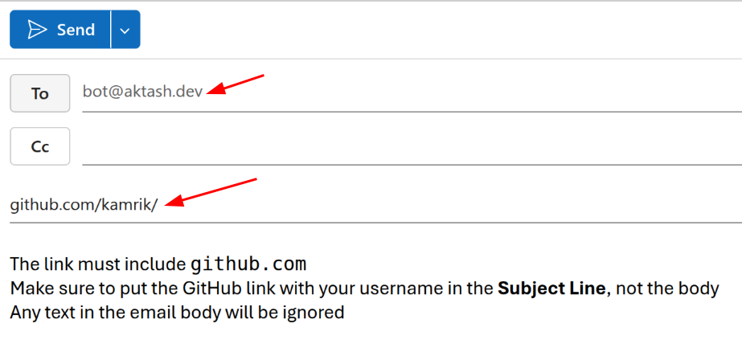

# COMP1238 - Week 2 Lab - GitHub setup

## Material Covered During the Lecture:
- How computer memory works
- Short-term (volatile) RAM memory vs persistent storage
- Representation of numbers and characters in computer memory
- ASCII table
- Text and binary files

## Goals for Today
- Create a GitHub account
- Complete a simple auto-graded assignment in GitHub
- If done early, practice touch-typing focusing on accuracy rather than speed

## 1. Create a GitHub Account
If you already have a GitHub account, skip to the next step.

 - Go to [github.com](https://github.com/)
 - Click "Sign Up" in the upper right corner
 - Using your private email is recommended since you will lose access to your GBC email a year after graduation.
 - You will need to choose a username. A repository address on GitHub looks like this:  
 `github.com/username/repository_name`  
 Take a look at the address of this instruction file and find the prof's username.
 

## 2. Email your GitHub account link to the bot at `bot@aktash.dev` from your GBC email
- Send the email from your George Brown email, emails from other domains will be ignored.
- Include your GitHub account link in the email **subject** line.
- A new repository will be created for you. This repository belongs to the `comp1238f26` organization and the address will look like this:  
 `github.com/comp1238f26/lab2-YourUsername`
- The bot will respond within 3 minutes with a link to your new repository.

## 3. Complete the assignment in your new repository
- Use the [autograder instructions](autograder_instructions.md) to find your way around your new repo.
- Open the lab2.txt file in that repo and complete the questions there.
  - When you save the lab2.txt file, a script will automatically check it.
  - You can see the results of your submission in the "Actions" tab of your repository.
  - You may save it multiple times, the best attempt counts.
