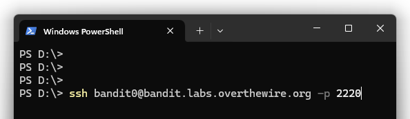
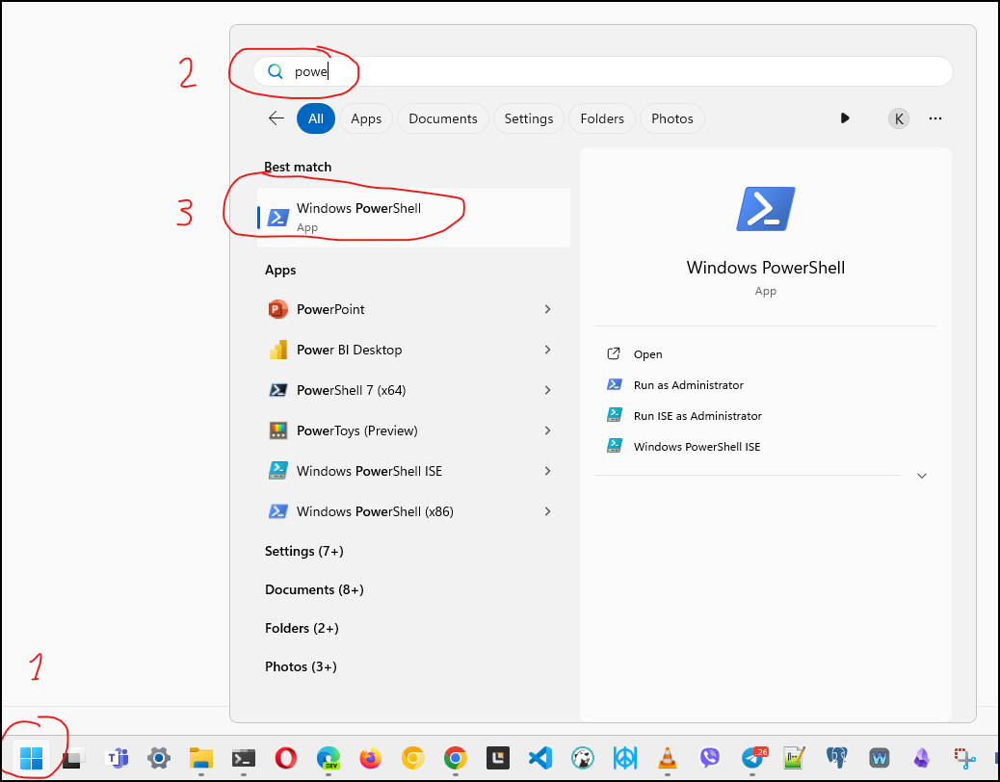

# Lab 5 - Learn the command line by playing a game

Today we will practice command line basics by playing the 
[Bandit](https://overthewire.org/wargames/bandit/)
game from the 
[Overthewire Wargames](https://overthewire.org/wargames/)
collection of games designed to teach IT professionals about information security.

The game is organized in levels, starting at 
[Level 0](https://overthewire.org/wargames/bandit/bandit0.html).
On each level, your goal is to find the password for the next level. The username used to log into the game indicates the level. `bandit0` for level 0, `bandit1` for level 1 and so on.

To start Level 0, connect to the game server using SSH on port 2220 with the command below. The username and password are both `bandit0`.
```
ssh bandit0@bandit.labs.overthewire.org -p 2220
```

Once you find the password for the next level, save it in a file on your computer and exit by running the `exit` command. You will return to your local computer prompt. To start the next level, log in again with the username of the next level:

`ssh bandit1@bandit.labs.overthewire.org -p 2220`

## How to open the terminal
- MacOS - open Spotlight (usually ⌘-Space) and start typing "terminal"
  - Or find it in `Applications` -> `Utilities`
- Windows - Open the ⊞Start menu (Win key) and start typing "Terminal"
  - Running `cmd`, `PowerShell`, or `Git Bash` instead of Terminal should also work.
 
> [!NOTE]  
> If you use an old version of Windows that does not include an SSH client, you can use [PuTTY](https://www.chiark.greenend.org.uk/~sgtatham/putty/latest.html) instead.

It should look like this in your terminal:



How to run Terminal or PowerShell on Windows:



## Submission
Follow the assignment invitation link  
https://classroom.github.com/a/jAaMpHNE  
Once your repository is created, edit the `passwords.txt` file. Save all the passwords you find during the game in that file. It also contains some hints.

Your goal is to reach level 3, the instructor and the autograder hints will guide you there, but feel free to keep going beyond level 3.

## Using the terminal - general tips

- When you type the password, nothing is shown - not even `*` characters. This is normal.

- The mouse behaves differently in the terminal: you cannot place the cursor with it. Use the arrow keys, as well as the `Home` and `End` keys if you have them. You can also try holding Ctrl or Alt while pressing the arrow keys to move the cursor faster.

- Copying and pasting in the terminal can be difficult. Practice copying text into the terminal before pasting the passwords. If you have trouble with the usual Ctrl+C and Ctrl+V, try using the mouse: you can double-click a word to select it, right-click to copy it to the clipboard, and right-click again (with nothing selected) to paste. On some systems, paste may be bound to middle-click instead of right-click. On Linux, Ctrl+Shift+C and Ctrl+Shift+V usually work for copying and pasting.

- Use the Tab key to autocomplete commands. For example, if you type `less re` and then press Tab, it may autocomplete to `less readme` when a file named `readme` exists in the current folder.

- Use the Arrow Up (↑) key to re-run a recent command without retyping it.

## Commands & features you may find useful
- `man` - short for "manual", example `man ls` will display help for the `ls` command. To exit the help text press `q`
- `ls` - list all files in the current directory; use `ls -a` to include hidden files. The `-a` option stands for "all". The `-l` option shows the long form, which includes file sizes.
- `cat` and `less` - both show the content of a text file. To quit from `less` press `q`
- `cd` - change directory. Examples: `cd labs`, `cd src/projectA/docs`
  - `cd ..` changes to the parent directory, one level up
- Command arguments can be quoted, like `cat "file with spaces.txt"`
- You may need to escape some characters, as in `cat file\ with\ spaces.txt` - in this case, the space character is escaped using `\`.

```
 __________________
< Have a good game >
 ------------------
        \   ^__^
         \  (oo)\_______
            (__)\       )\/\
                ||----w |
                ||     ||
```


