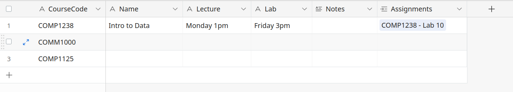
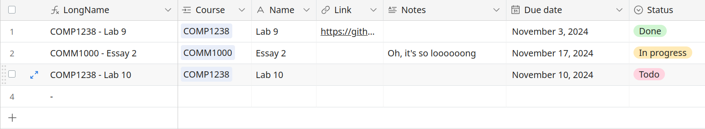
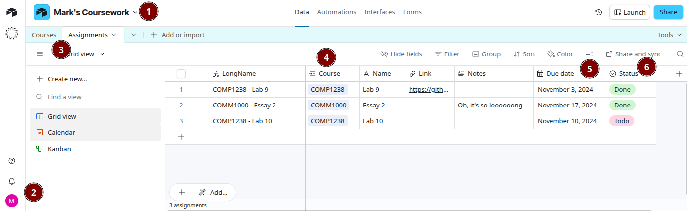

# Lab 10 - Airtable

Please submit on D2L as a screenshot (not via GitHub). See instructions at the bottom of this page.

## Material covered during the lecture:

- Spreadsheets
- Airtable

## Today's goal

Explore Airtable by creating a simple database with your courses and assignments.

## Step 1 - Create an Airtable account

Sign up for a free Airtable account at https://airtable.com/. You can use any email address to sign up. The easiest option is to sign up using your Google or Apple account.

## Step 2 - Create a new database

- Don't use any templates; start from scratch.
- Create 2 tables: Courses and Assignments.
- Use the course code, like `COMP1238`, as the first column of the Courses table.

- In the **Assignments** table:
  - Make sure it has a Due Date column of type `Date`.
  - Make sure the Course column is of type `Link to Courses`.
  - The first column should be of type Formula and concatenate the course code with the assignment name. You can use a formula like this: `Course & " - " & Name`. The `&` symbol concatenates (adds) two strings together.
- In the **Courses** table, create a Gallery view and see how it looks with at least two courses entered.

## Optional tasks

- Make sure there is a Status field of type "Single Select" in the Assignments table, and the selectable options include "In progress" and "Done".
- Create a Kanban view for this table. Try dragging assignments between the columns.
- Create a Calendar view based on the Due Date column.

## Examples of how the tables should look

## Submission instructions

Submit a screenshot of your Assignments table. Use a full-screen or full-window screenshot so that the database name is visible.
Use the following checklist:

1. The database name is visible and includes your name (your first name is sufficient).
1. Your avatar icon in the bottom left corner is visible.
1. The database contains two tables: Assignments and Courses.
1. The Assignments table contains a "Course" column of type `Link to Courses`.
1. The Assignments table contains a "Due Date" column of type `Date`.

