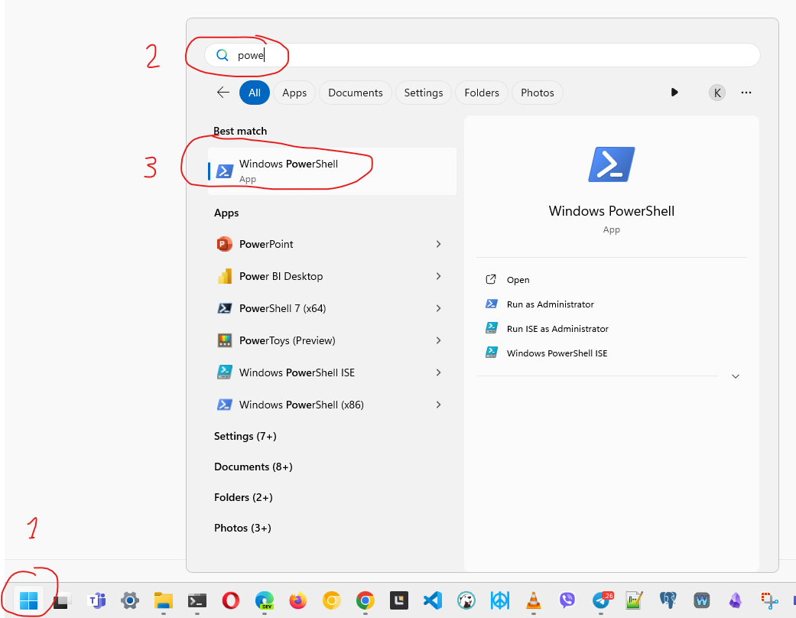

# Lab 5 - learn command line by playing a game

Today we will be playing the 
[Bandit](https://overthewire.org/wargames/bandit/)
game from 
[Overthewire Wargames](https://overthewire.org/wargames/)
collection of games that are designed to teach IT professionals about information security.

The Bandit game helps to learn command line basics.

The game is organized in levels starting at 
[Level 0](https://overthewire.org/wargames/bandit/bandit0.html),
on each level your goal is to find the password for the next level. The username used to log in indicates the level. `bandit0` for level 0, `bandit1` for level 1 and so on.

To start Level 0 connect to the game server using SSH on port 2220 using this command. The username and password are both `bandit0`
```
ssh bandit0@bandit.labs.overthewire.org -p 2220
```

Once you find the password for the next level, save it somewhere and exit by running the `exit` command. You will be back to your local computer prompt. In order to start the next level, log in again with the username of the next level  
`ssh bandit1@bandit.labs.overthewire.org -p 2220`

## How to open the terminal
- MacOS - open Spotlight (usually ⌘-Space) and start typing "terminal" - run it
  - Or find it in `Applications` -> `Utilities`
- Windows - Open the ⊞Start menu (Win key) and start typing "Power Shell" - run it
  - running `cmd` or `Terminal` instead of Power Shell may work ok too
 
> [!NOTE]  
> If you have an old version of Windows that does not include an SSH client, you can 
use [PuTTY](https://www.chiark.greenend.org.uk/~sgtatham/putty/latest.html) instead.

It should look like this in your terminal  


How to run PowerShell terminal on Windows



## Submission
Run the `date` command while logged into Bandit and submit a screenshot of your terminal.
Your goal is to reach level 3, the instructors will guide you there, but feel free to keep going beyond level 3.

Your screenshot should look similar to this one:  


## Using the terminal - general tips
- The mouse works in a weird way in the terminal, you can't place a cursor using the mouse, user arrow keys and `home` and `end` keys if you have them. Also try the arrow keys with ctrl or alt pressed, the cursor will jump faster.
- Copying and pasting in terminal might be difficult. In most cases double click a word with a mouse to select it, right-click copies it to clipboard, right-click again (with nothing selected) will paste it. 
- When you type the password, nothing is shown, not even `*` characters, that's ok
- Use the Tab key, it may be able to autocomplete the command. E.g. you started typing `less re` and then press Tab, it might autocomplete it to `less readme` if there is a file named readme in the current folder
- Use the ↑ arrow key to re-run a recent command without re-typing them

## Commands & features you may find useful
- `man` - short for "manual", example `man ls` will display help for the `ls` command. To exit the help text press `q`
- `ls` - list all files in current directory, to include hidden files use `ls -a`, the `-a` option statnds for "all". `-l` is for long form that includes file sizes.
- `cat` and `less` - both show the content of a text file. To quit from `less` press `q`
- `cd` - change directory. Examples: `cd labs`, `cd src/projectA/docs`
  - `cd ..` changes to the parent directory, one level up
- Command arguments can be quoted, like `cat "file with spaces.txt"`
- You may need to escape some characters, like `cat file\ with\ spaces.txt` - in this case the space character is escaped using `\`

```
 __________________
< Have a good game >
 ------------------
        \   ^__^
         \  (oo)\_______
            (__)\       )\/\
                ||----w |
                ||     ||
```


